# Hack The Box
## Total Points: 60 pts
__________________________________________________________________________________________
### Pre-Challenge 0: Getting The Invite Code [0 pts]
First, I looked through the script files using the developer tools in chrome. I completed this task during my internship last summer and was given a hint from my mentor to search through the src first (and many other tips...). I found the following three scripts:  

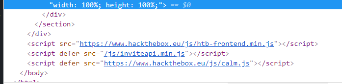

In inviteapi.min.js, the following code was found which listed a group of functions which could be run from the console. The "makeInviteCode" function seemed interesting, so I gave it a try in the console. Here was the response:  

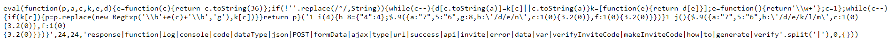

Within the response above, the data section was encrypted with ROT13 which can be seen in the object returned in the response below:  

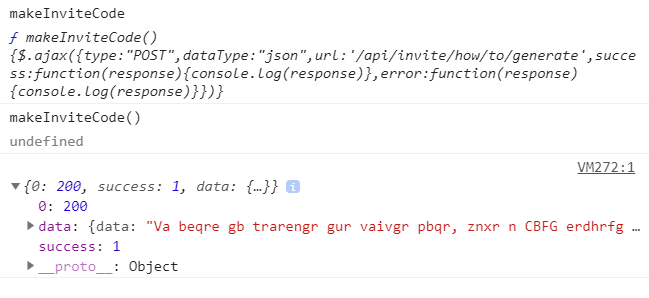

I looked up a ROT13 decoder and put in the ciphertext. The plaintext response can be seen below:    

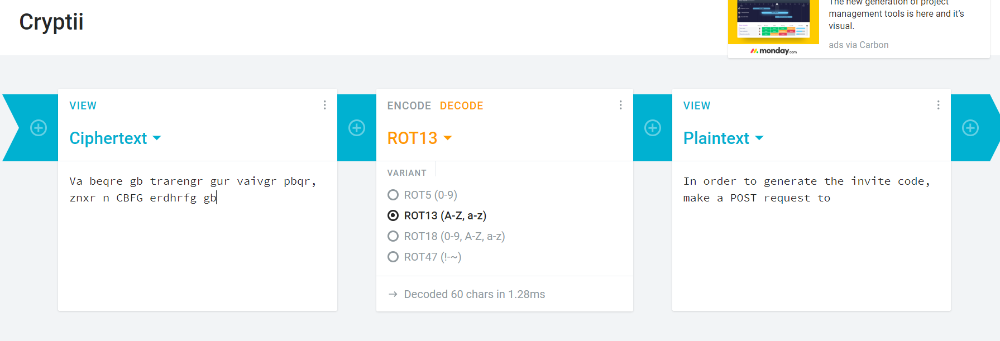

I then created a POST request and received the following code which was encoded with base64:  

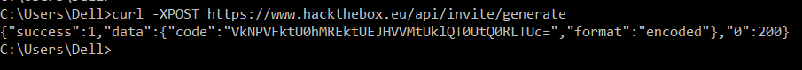

Here is the invite code to create an account!  

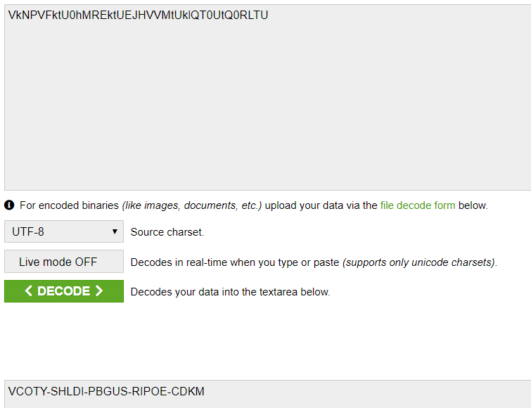

### Challenge 1: Reversing Snake [10 pts]
The first challenge I completed was reversing the snake program. This one was pretty easy. I was given a python program in which I had to reverse what the code was doing. I had to find the username and password asked for in the program. The flag was a concatenation of the username and password. The full break down can be seen below:  

The first thing I did was to identify what the username as password are looking for. The username is comparing the first user input with the "slither" variable which is a concatenation of various shellcode values defined above it. I used a hex to ascii converter I found online. The username found was "anaconda".  

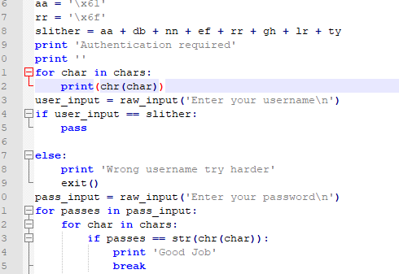

Next, I needed to idenitfy how to bypass the password. The code shows that it compares each character in the variable chars with the second user input. After looking through the code and trying to reverse this variable I realized...Why don't I just print it? I have the source! So I made a for loop in the code that prints chars. The output can be seen below:  

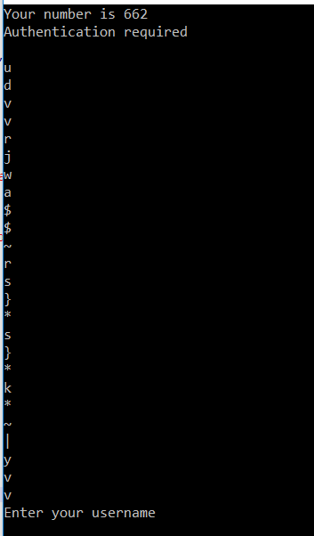

After putting the first character in the program sucessfully exited, but...where was the flag? This actually ended up being the most time consuming portion of this challenge. After quite a few tries I finally went back to the challenge on hack the box to read the question more carefully and found the flag format is HTB{username:password}. This result can be seen below:

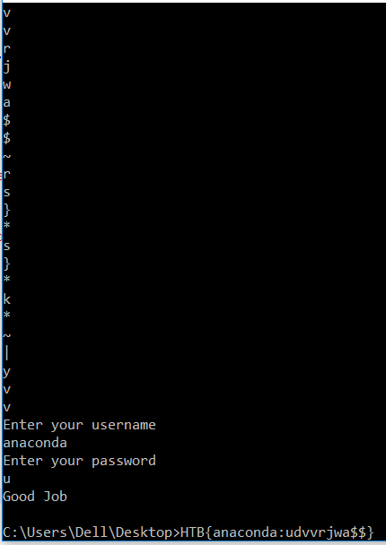

Success!!!!  

### Challenge 2: Web Lernaean [20 pts]

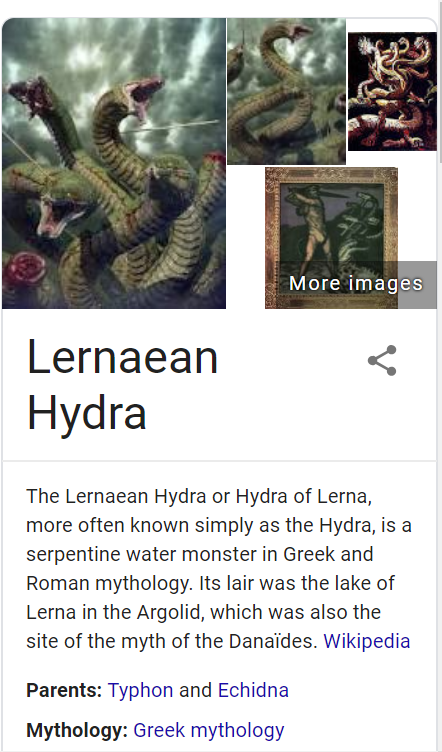

The second challenge I completed was a web penetration challenge: lernaean (the name was a huge clue!). Lernaean was a serpentine water monster in Greek and Roman mythology often coined "Hydra". Hydra is also the name of a popular password cracking program. I booted up my kali linux box in virtual box and cracked the password - 'leonardo'. I then used burpsuite to intercept the request and then used the repeater to see the response which contained the flag. The full breakdown can be seen below:  

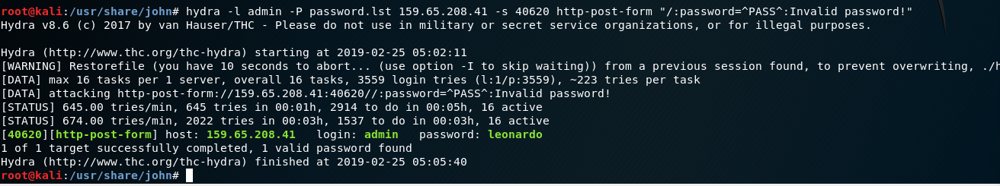

The command above utilizes the hydra program in kali linux attacking the IP (found from a DNS lookup) on port 40620 using a default password list provided in Kali called "password.lst". The password "leonardo" was cracked, and access to the site was gained.  

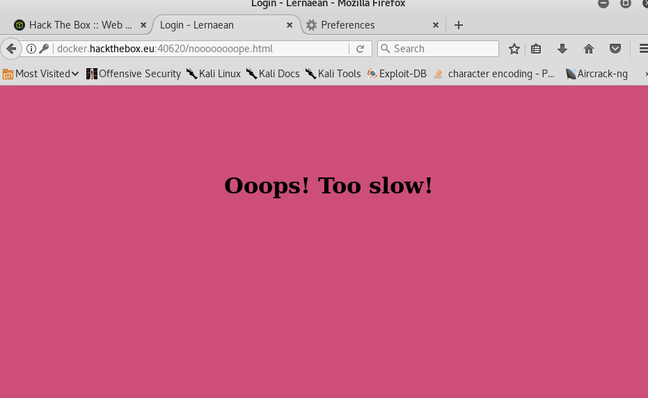

After accessing the site, I recieved the message "too slow". This was another clue that there may be additional information in the request/response. I decided to boot up the burpsuite tool and intercept the request. I set up a proxy on firefox through the burpsuite program and found the following response:  

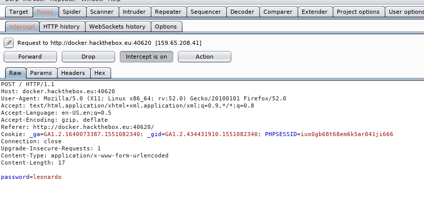

When given to the repeater, this was this response (which contained the flag, yay!).  

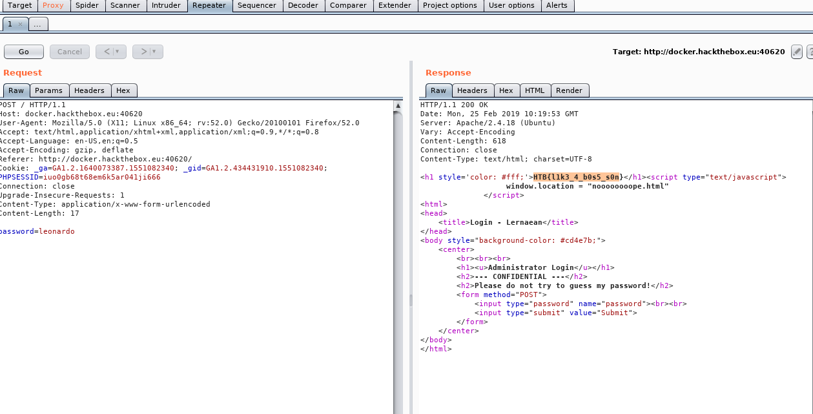

Sucesss!!!!  

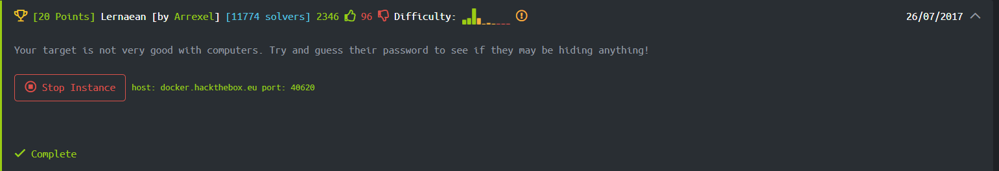

### Challenge 3: Web Cartographer [30 pts]

The third challenge I completed was a web penetration challenge: Cartographer (the name was also a clue!). Cartography is the study and practice of making maps. There is a tool in kali linux called sqlmap. I decided to first run the sqlmap program which identified the back-end DBMS, OS, and web application technology. After moving to an SQL injection I almost immediently got into the site using one of the most basic injections (often found on cheat sheets): 'or'1'='1. Once in the site, I spent way to much time trying to figure out what to next. I finally changed the query from info=home to info=flag. The full breakdown can be seen below:    

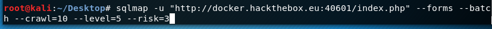

I began with a simple run of sqlmap based on the name of the challenge which can be seen above:  

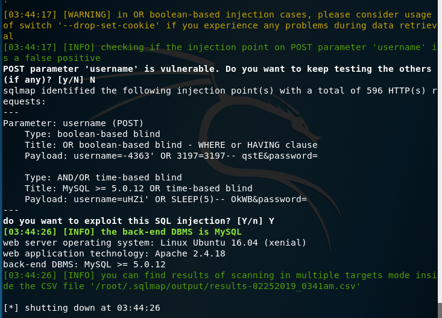

One of the most basic injections (often found on cheat sheets): 'or'1'='1 worked on the site which I found on OWASPS SQL injection materials. This can be seen below:  

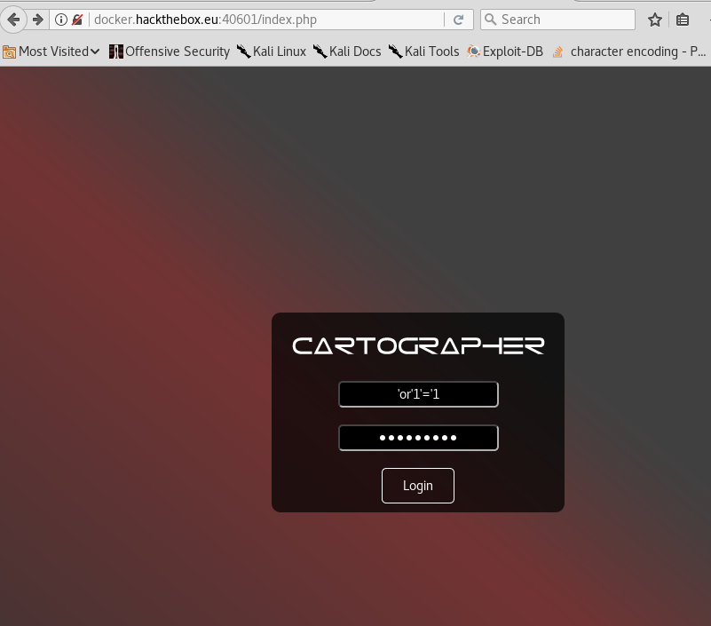
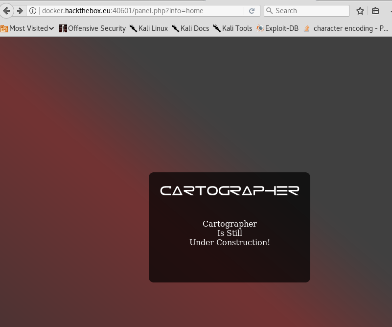

Once in the website, I tried using dirb to enumerate potential paths within the site. I didn't find anything initially, but with a different word list, I was able to find the proper query: ?info=flag (of course...).

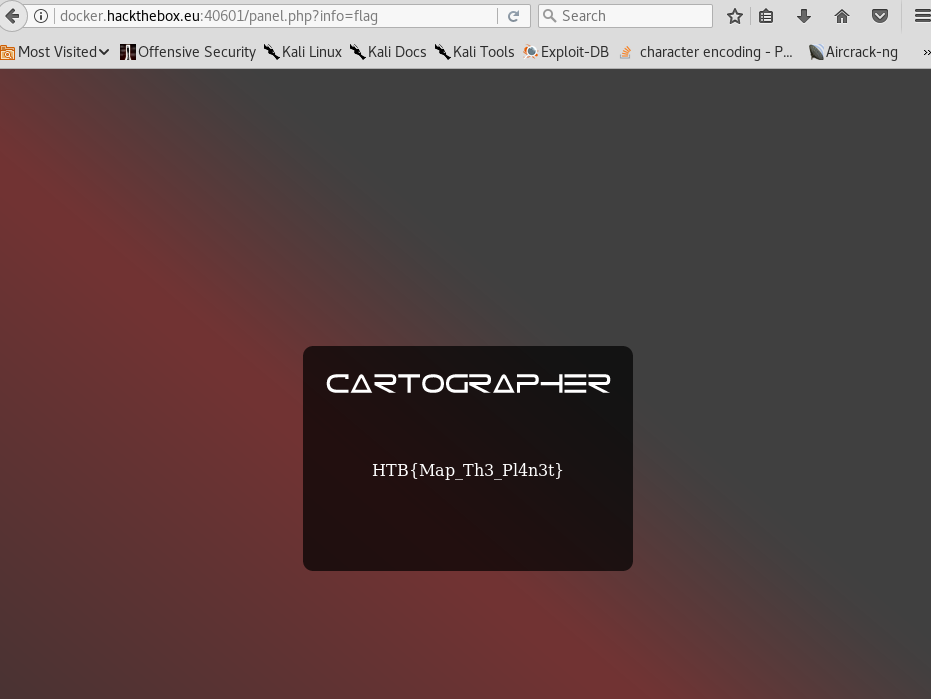

Success!!!!

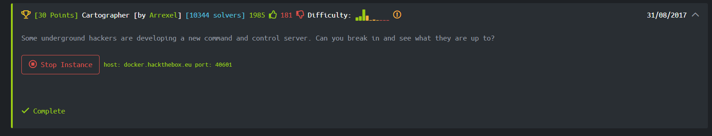
