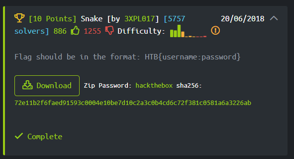

# Hack The Box
## Total Points: 60 pts
__________________________________________________________________________________________
### Pre-Challenge 0: Getting The Invite Code [10 pts]
First, I looked through the script files using the developer tools in chrome. I completed this task during my internship last summer and was given a hint from my mentor to search through the src first (and many other tips...). I found the following three scripts:  

In inviteapi.min.js, the following code was found which listed a group of functions which could be run from the console. The "makeInviteCode" function seemed interesting, so I gave it a try in the conosle. Here was the response:  

Within the response above, the data section was encrypted with ROT13 which can be seen in the object returned in the response below:  

I looked up a ROT13 decoder and put in the ciphertext. The plaintext response can be seen below:    

I then created a POST request and received the following code with was encoded with base64:  

Here is the invite code to create an account!  

### Challenge 1: Reversing Snake [10 pts]
The first challenge I completed was reversing the snake program. This one was pretty easy. I was given a python program in which I had to reverse what the code was doing. I had to find the username and password asked for in the program. The flag was a concatenation of the username and password. The full break down can be seen below.  

The first thing I did was to identify what the username as password are looking for. The username is comparing the first user input with the "slither" variable which is a concatenation of various shellcode values defined above it. I used a hex to ascii converter I found online. The username found was "anaconda".  

Next, I needed to idenitfy how to bypass the password. The code shows that it compares each character in the variable chars with the second user input. After looking through the code and trying to reverse this variable I realized...Why don't I just print it? I have the source! So I made a for loop in the code that prints chars. The output can be seen below.  

After putting the first character in the program sucessfully exited, but...where was the flag? This actually ended up being the most time consuming portion of this challenge. After quite a few tries I went back to the challenge on hack the box to read the question more carefully and found the flag format is HTB{username:password}. This result can be seen below.

Success!!!!  

### Challenge 2: Web Lernaean [20 pts]

### Challenge 3: Web Cartographer [30 pts]

